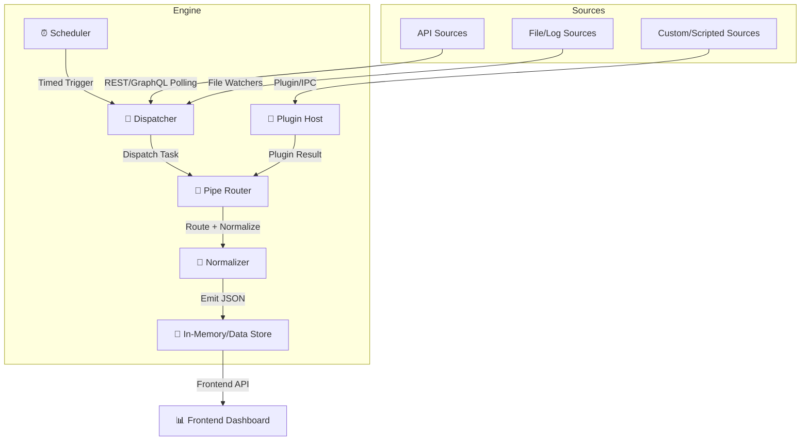

## Architecture

The `acme` platform focuses on providing a secure, robust, and efficient synchronization utility that aggregates and processes data from various sources. The architecture is designed to be modular and extensible, allowing for easy integration of new data sources and sinks.

### _Diagram 1_: Engine Architecture

This diagram illustrates the architecture of the ACME Engine, which is designed to automate and orchestrate tasks across various sources and sinks. The engine consists of several key components that work together to process data from different sources, normalize it, and store it for further use. The architecture is modular, allowing for extensibility through plugins and custom sources.

